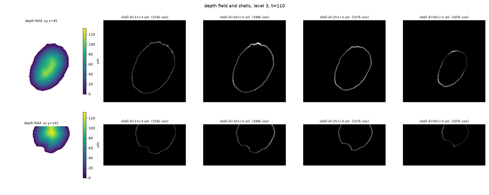
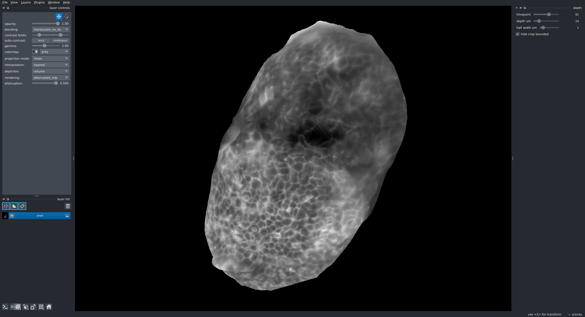

# embryo-depth

A tool for browsing a light-sheet embryo volume by **depth beneath the sample surface** rather
than along the xyz imaging axes. Segments the embryo, computes a distance transform from its
surface, and drives a napari slider that shows the shell of tissue at depth `d`.

The purpose is interactivity, and the hot axis is time: pick a depth, then scrub every timepoint
in 3D hunting for events. Depth changes are occasional; time changes are constant and need to feel
instant — the shell viewer is benchmarked at 40+ fps while scrubbing time at its default level.

<p align="center">
  
</p>

The left column is the raw depth field (distance from the surface, in µm); each column after it is
a thin shell pulled out at a fixed depth — this is the EDT computation the whole pipeline exists to
get right.

<p align="center">
  
</p>

The shell viewer: a napari volume layer plus sliders for timepoint, depth, and half-width, rendered
directly from the depth-bucketed index rather than recomputed per frame.

## Install

```bash
uv sync
```

Requires Python 3.10–3.12. Reads and writes [OME-NGFF](https://ngff.openmicroscopy.org/) (zarr v2)
stores; nothing here is specific to a particular imaging setup beyond that format.

## Pipeline

Run once per dataset, in order:

```bash
uv run python -m embryo_depth.segment    # threshold -> mask, level 4: labels/embryo/4
uv run python -m embryo_depth.review     # verification gate: inspect the mask before continuing
uv run python -m embryo_depth.upscale    # mask -> full label pyramid: labels/embryo/0..4
uv run python -m embryo_depth.depth --workers 8   # distance transform: depth/1..4
```

Then browse:

```bash
uv run python -m embryo_depth.viewer --level 3   # standalone shell viewer
```

Or use it as a napari plugin (`embryo-depth` is registered as an `napari.manifest` entry point) —
open a store through napari's own File > Open, or launch the "Depth shells" dock widget.

**Stop at the review gate.** A wrong segmentation produces a depth field that looks smooth and
plausible while being wrong, and there's no later step where the mistake becomes obvious.

## Test

```bash
uv run pytest
```

## License

MIT — see [LICENSE](LICENSE).
